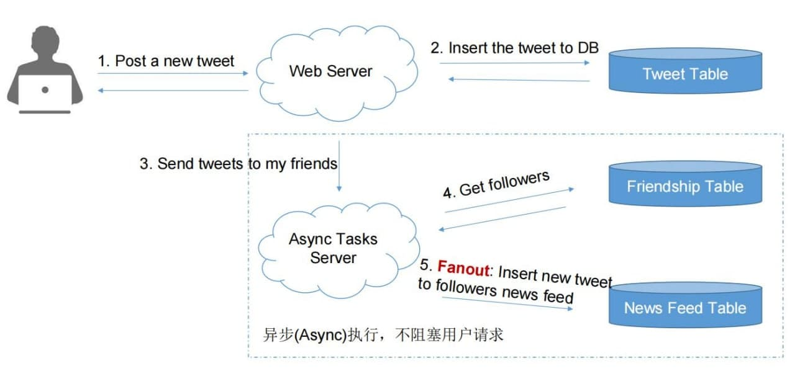
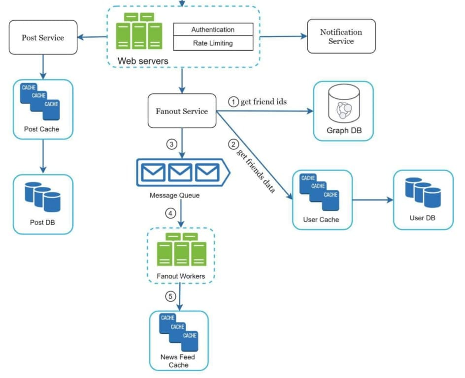

## 环境准备

### mysql

```dockerfile
sudo docker run -p 3306:3306 --name mysql -e MYSQL_ROOT_PASSWORD=123456 -d mysql:5.7

或者
sudo docker run -p 3306:3306 --name mysql \
-v /usr/local/docker/mysql/conf:/etc/mysql \
-v /usr/local/docker/mysql/logs:/var/log/mysql \
-v /usr/local/docker/mysql/data:/var/lib/mysql \
-e MYSQL_ROOT_PASSWORD=123456 \
-d mysql:5.7


docker exec -it 
建好所需数据库
```

https://www.cnblogs.com/sablier/p/11605606.html

### redis

```dockerfile
docker run --name redis -d redis

 另起一个redis 连接
docker run -it --network some-network --rm redis redis-cli -h some-redis
```

https://hub.docker.com/_/redis

### kafka

```dockerfile
version: '3'
services:
  zookeeper:
    image: wurstmeister/zookeeper
    ports:
      - "2181:2181"
  kafka:
    image: wurstmeister/kafka
    depends_on: [ zookeeper ]
    ports:
      - "9092:9092"
    environment:
      KAFKA_ADVERTISED_HOST_NAME: 172.17.0.1
      KAFKA_CREATE_TOPICS: "tweet:1:1"
      KAFKA_ZOOKEEPER_CONNECT: zookeeper:2181
    volumes:
      - /var/run/docker.sock:/var/run/docker.sock
```

https://segmentfault.com/a/1190000021746086

https://blog.csdn.net/boling_cavalry/article/details/85395080

https://www.baeldung.com/ops/kafka-docker-setup

### jaeger

```do
docker run \
  --rm \
  --name jaeger \
  -p6831:6831/udp \
  -p16686:16686 \
  jaegertracing/all-in-one:latest
```

http://localhost:16686/  打开ui

### consul

```dockerfile
docker run -d -p 8500:8500 -p 8300:8300 -p 8301:8301 -p 8302:8302 -p 8600:8600/udp  consul consul agent  -dev -client=0.0.0.0

docker container update --restart=always 容器名字
```

http://localhost:8500/ 打开ui

## 架构

参考





